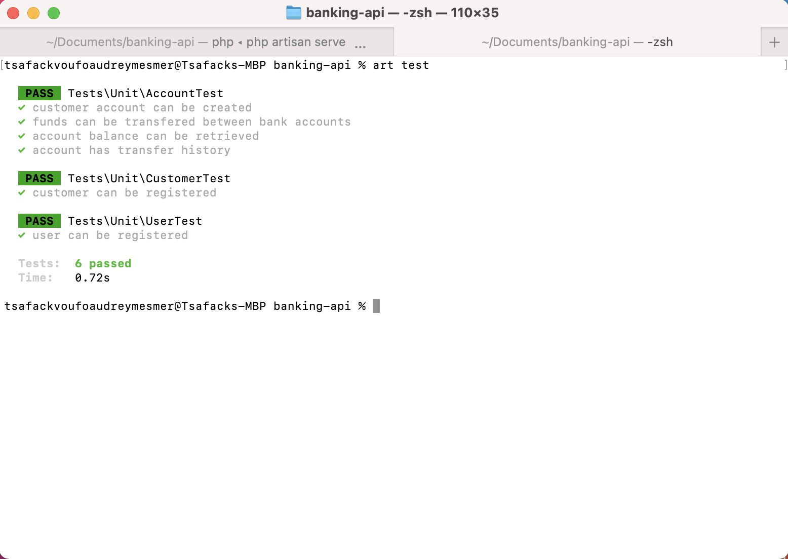

# Banking API

## Objective

An internal API for a fake financial institution using PHP and Laravel.

## Brief

This is a basic backend API for bank employees. It could ultimately be consumed by multiple frontends (web, iOS, Android etc).

## Tasks

- Programming Language used:
  - Language: PHP
  - Framework: Laravel
- API routes allow bank users to:
  - Authenticate
  - Create a new bank account for a customer, with an initial deposit amount. A single customer may have multiple bank accounts.
  - Transfer amounts between any two accounts, including those owned by different customers.
  - Retrieve balances for a given account.
  - Retrieve transfer history for a given account.
- All endpoints are only accessible if an API key is passed as a header.
- All role-based endpoints require authentication.
- Business logic test written.
- A documentation that says what endpoints are available and the kind of parameters they expect can be viewed from the section below.
- All required models and routes of the API have been designed.

## API Documentation

The API Documentation is published on this link https://documenter.getpostman.com/view/5302093/UVRAHSYU

## Requirements
Make sure your server meets the following requirements.

-   Apache 2.2+ or nginx
-   MySQL Server 5.7.8+ , Mariadb 10.3.2+ or PostgreSQL
-   Composer installed 1.9+
-   PHP Version 7.2.x+

## Setup

Clone this project by running the following command
``` bash  
$ git clone https://github.com/tsaffi/banking-api.git 
```

Navigate into the project's directory
``` bash  
$ cd banking-api 
```

Copy .env.example for .env and modify according to your credentials
```bash
cp .env.example .env
```

Run this command to install dependencies
```bash
composer insatall
```
This command will install all dependencies needed by the banking api to run successfully!

Generate application key
```bash
 php artisan key:generate
```

This command will help migrate the database and populate the database!
```bash
php artisan migrate --seed
```

Create the Laravel oauth tokens using passport
```bash
php artisan passport:install
```
## Usage

Run the default laravel server
```bash
php artisan serve
```

To view banking-api api go to:

https://banking-api-237.herokuapp.com/api/

## Test

To run some tests, use the command below

```bash
php artisan test
```


<p align="center">
    
</p>
